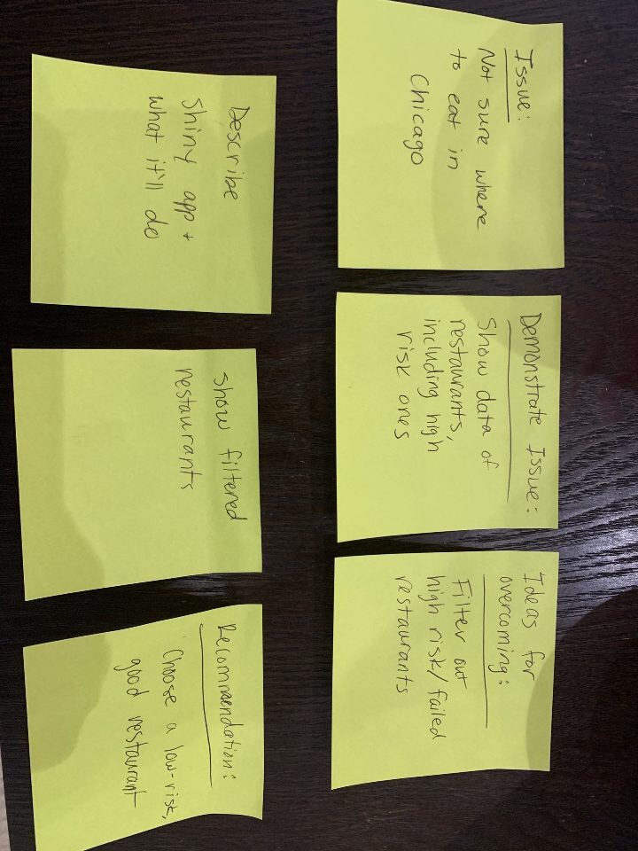

# HW 6 Introduction

The Final Project is a group demonstration in which students will form their own groups of *a minimum of 3 and maximum of 5*. All students will create a Shiny app following guidelines and references discussed in the last few weeks of the STAT 385 course. 

**Shiny app**

The Shiny app is a web-based interface for users to interact with data and see how certain statistical properties change as otheraspects change. The coding demonstration should utilize one of the datasets in the [Datasets.html](https://uofi.box.com/shared/static/kv89ff7n55bkjsxrsx9nlthpl1yocqpo.html) file on the course website (it was updated on November 6, 2019). The background information and links for those datasets will help students understand the data. See the following sites as exmaples of already made Shiny apps.

- https://vnijs.shinyapps.io/radiant/?SSUID=f58d479fac

- https://shiny.rstudio.com/gallery/movie-explorer.html

- https://shiny.rstudio.com/gallery/retirement-simulation.html

- https://github.com/rstudio/cheatsheets/raw/master/shiny.pdf

**Presentation**

Students should submit all code files used to create the Shiny app by 11:59 PM on December 19, 2019 (upload into Compass). Prior to that deadline all students will present their demonstrations as their final exam. Section 1 of STAT 385's presentations will be Thursday December 19, 2019 in Turner Hall W109 beginning at 8 am. Each group will get 4 minutes to present their demonstrations, with roughly 1 minute for questions (priority of asking questions belongs to the Instructor).

**Grading**

As mentioned in the syllabus, the Instructor will give a grade for the presentations. Following that grading, students in the group can decide to allocate the points in a way that is agreed upon by all members of the group with the following restrictions: No student's score can be > 100 or < 0. For example, if there are 3 people in a group and the Instructor's grade is a 90 out of 100, then the group has 90*3=270 points they can allocate. The standard grade will be an equal amount of points per student. Thus in the example, each student would receive a 90 out of 100 for their grade.

***

## HW 6 Problem

1. By 11:59 PM on Monday December 2, 2019, all student groups will be required to submit a final project proposal and a storyboard (as a single Rmd file; this will likely be presented as a homework assignment). See Chapter 1 of Knaflic's **Storytelling with Data** for ideas on creating a storyboard. The proposal should include the following information:

- group members' names
  -Andro Manukov, Hermes Pazos, Mallory Root, David Alegre, Jamie Kenna
- tentative title of the project
  -Chicago Area Restaurants Near Me! (new)
- the dataset
  -Chicago Food Inspections
    -Variables:
      DBA NAME,
      Facility Type,
      Risk,
      Results,
      Latitude,
      Longitude
- summary of the intentions and goals of the project
  Observe risk and result (pass/fail) of food areas in chicago,
  Taking user inputted address and find Restaurants sorted by nearest to that address. Output as an interactive plot and/or datatable,
  Allow user to filter results based on risk tolerance (?)
- storyboard
  

